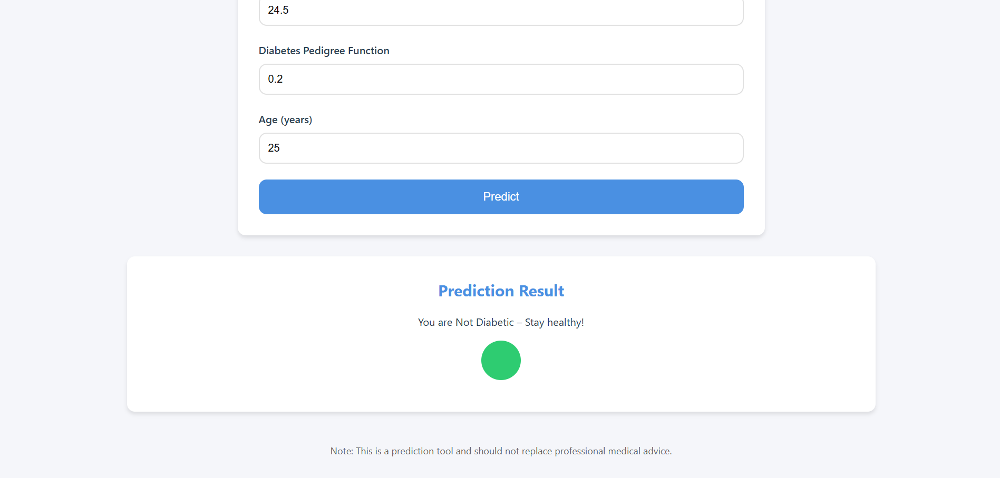
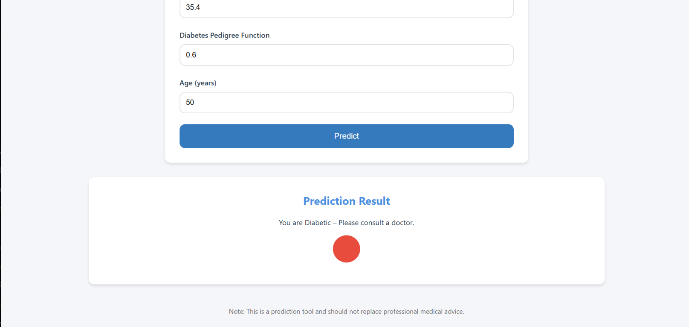
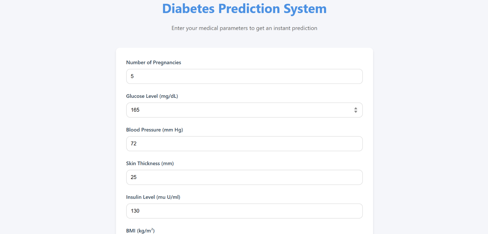

# Diabetes Prediction Web Application

A full-stack web application for predicting diabetes based on medical parameters. Built with FastAPI and vanilla JavaScript.

## Features

- Clean and modern user interface
- Real-time form validation
- Responsive design for all devices
- Fast and accurate predictions
- Beautiful animations and transitions
- Comprehensive error handling

## Prerequisites

- Python 3.8 or higher
- pip (Python package manager)
- A modern web browser

## Setup

1. Clone the repository:
```bash
git clone <repository-url>
cd diabetes_web
```

2. Create a virtual environment (optional but recommended):
```bash
python -m venv venv
source venv/bin/activate  # On Windows: venv\Scripts\activate
```

3. Install the required packages:
```bash
pip install -r requirements.txt
```

## Running the Application

1. Start the FastAPI backend:
```bash
python app.py
```
The API will be available at `http://localhost:8000`

2. Open the frontend:
- Simply open the `index.html` file in your web browser
- Or use a local server (recommended):
  ```bash
  python -m http.server 8080
  ```
  Then visit `http://localhost:8080`

## API Documentation

Once the backend is running, you can access:
- Swagger UI documentation: `http://localhost:8000/docs`
- ReDoc documentation: `http://localhost:8000/redoc`

## Usage

1. Fill in the form with the required medical parameters:
   - Number of Pregnancies
   - Glucose Level
   - Blood Pressure
   - Skin Thickness
   - Insulin Level
   - BMI
   - Diabetes Pedigree Function
   - Age

2. Click the "Predict" button to get the prediction

3. View the result displayed in a card below the form

## Input Validation

The application validates all inputs to ensure they are within acceptable ranges:
- Glucose and BMI and age must be greater than 0
- All other parameters must be non-negative
- Each parameter has specific minimum and maximum values

## Error Handling

The application provides clear error messages for:
- Invalid input values
- API connection issues
- Server errors

## Contributing

Feel free to submit issues and enhancement requests! 



